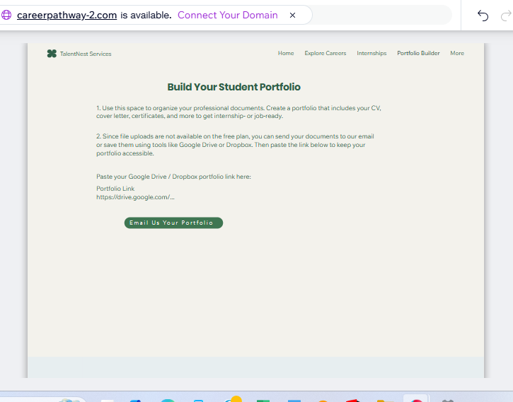
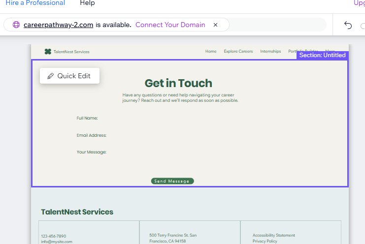

# CareerPathway Website

---

**Short summary**  
CareerPathway is a student career-exploration and internship-finding platform prototype created for my POE. It helps students explore different career fields, access internship opportunities, and build the skills they need while studying.

**My role**  
UX/UI planning, researching user needs, creating page structures, and building a working website prototype using Wix.

**Tools used**  
Wix Website Builder  

**What I delivered**  
- A functional prototype of the CareerPathway website using Wix  
- Pages including: Homepage, Career Explore, Internship Board, Technology Career, Skills&Resources, Portfolio Border, and Contact  
- Clear navigation and layout design  
- A short project reflection  
- User-friendly visual structure and branding

**Files to upload**  
- Wix screenshots (homepage, career explore page, technology career, skills & resources, internship board, login page, portfolio border, contact)  
- Project reflection PDF (`careerpathway-reflection.pdf`)

**Highlights**  
- Clean and simple user interface  
- Easy navigation between career fields and internship options  
- Realistic layout showing how students can search, explore, and apply  
- Built fully on Wix without code

---
## 📸 Screenshots

###  Homepage

###  Career Explore Page

###  Technology Career
! [Technology Career](screenshots/technology-career.png)

###  Internship Board

###  Skills and Rescources

###  Portfolio Builder 

###  Contact

