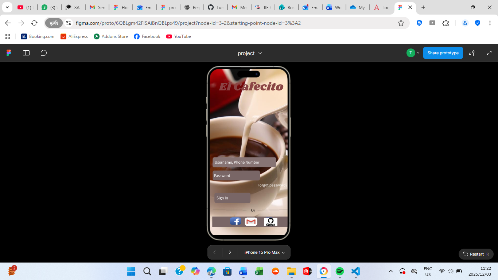
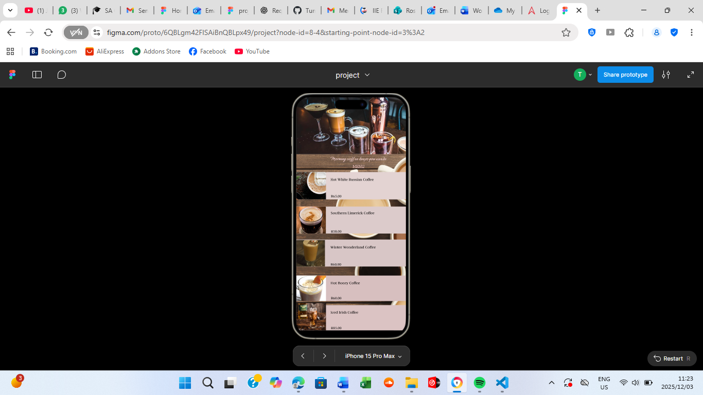
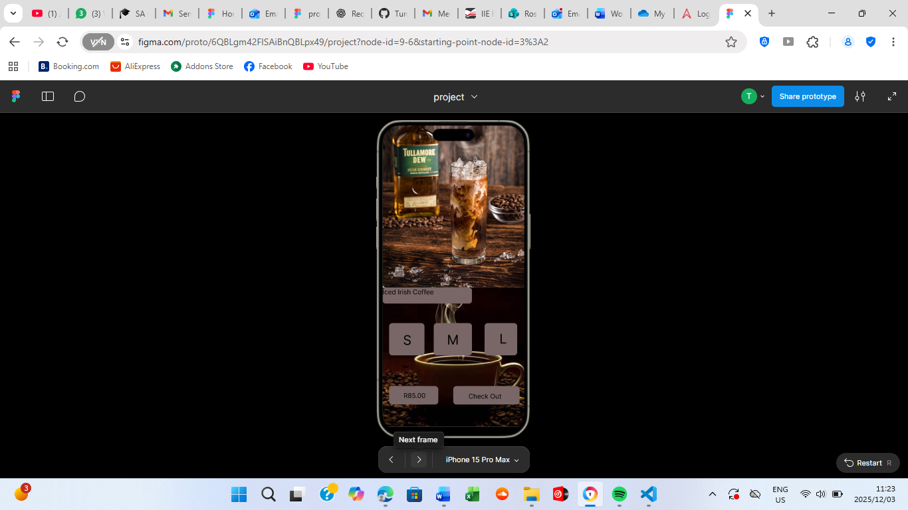
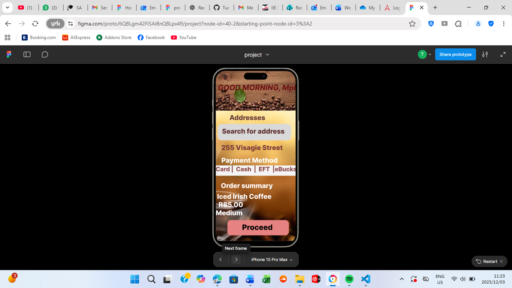
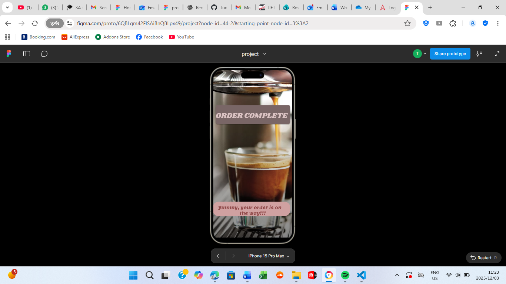

# EL CAFESITO – Coffee Shop App (Figma Prototype)

**Summary**
Mobile app prototype for a coffee shop ordering system. Built for IT Professional Practice module.

**My role**
UI/UX design, user flow, screens for signup/login, menu, checkout and confirmation.

**Tools**
Figma.

**Files to upload**
- Figma export images (login, menu, checkout)
- A short project reflection (PDF)

**Highlights**
- Registration & login screens
- Product menu with images & prices
- Size of the item you chose
- Checkout flow and order confirmation

---

## 📸 Screenshots

### 🔐 Login Screen

### 🍽️ Menu Screen

### 📏 Size Selection

### 🛒 Cart

### ✅ Order Complete

